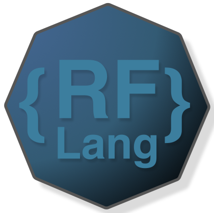

# RF Lang
RF Lang is a hobby programming language heavily inspired by the C programming language.

# Support
The `rfc` compiler currently doesn't support codegen at all. However the roadmap for support would be:<br>
|Platform    |Status|Priority|
|------------|------|--------|
|x86_32_linux|WIP   |Medium  |
|x86_64_linux|WIP   |High    |
|arm64       |WIP   |Low     |

# Installation
To use the `rfc` compiler, you must build it from source at the moment. I do not plan on supplying prebuilt binaries for it.
To do this...
```console
$ git clone https://github.com/rfmineguy/rflang-2.git --depth 1
$ cd rflang-2
$ mkdir build
$ cd build
$ cmake ..
$ sudo make install
```

# Basic Usage
```console
$ rfc -f <input_file> -o <output_file> -p <target_platform>
```

* Look into  to create further language documentation
